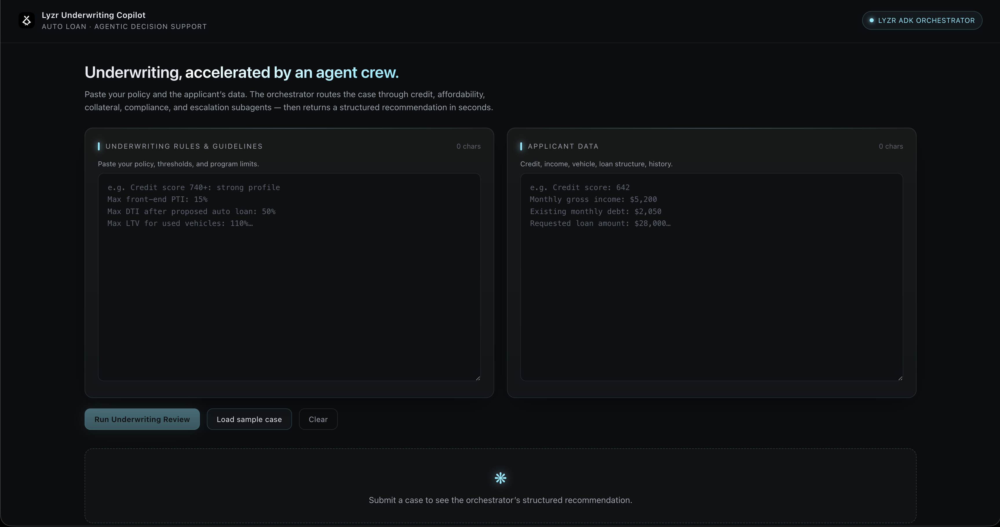

# 🏛️ Lyzr Assistant: Auto-Loan Underwriting Industry



An underwriter copilot that turns pasted loan policy + applicant data into a
YES/NO recommendation with explanations, powered by a [Lyzr ADK](https://pypi.org/project/lyzr-adk/)
orchestrator agent.

## Quick start

```bash
./lyzr.sh
```

Or launch both services directly:

```bash
./scripts/start.sh
```

- Dashboard → <http://localhost:5173>
- API health → <http://localhost:8000/api/health>

## Layout

- `backend/` — FastAPI service wrapping the Lyzr orchestrator (`backend/README.md`)
- `frontend/` — Vite + React dashboard, dark arctic theme (`frontend/README.md`)
- `agents/` — Orchestrator + sub-agent prompts (generated locally and saved in Lyzr)
- `scripts/` — `start.sh`, `deploy_backend.sh`, `deploy_frontend.sh`
- `docs/` — Bootstrap brief, research notes, journal
